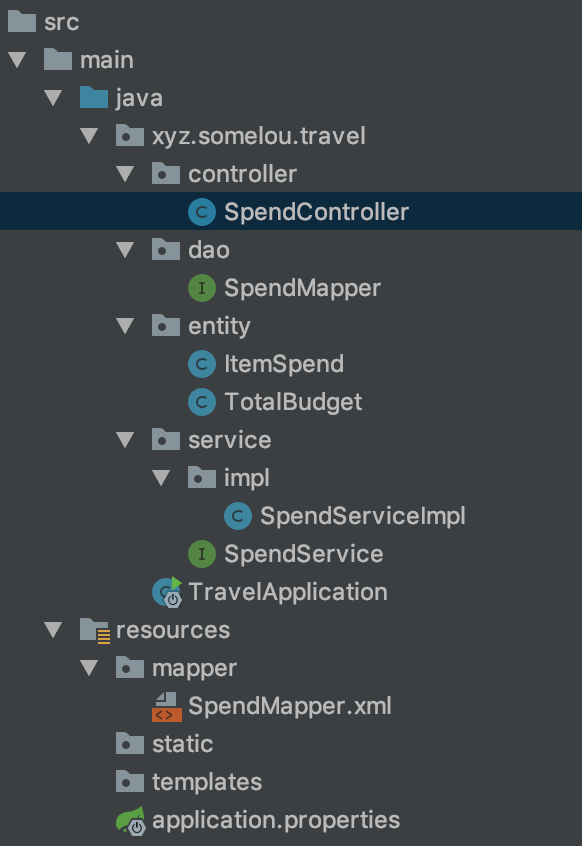

# travel-springboot-demo

这个项目实际上是我服务计算概论课的一部分，题目要求是：编写简单的旅行预算管理服务的接口并做一个调用它的程序。因为最近正好学习了springboot框架，就以此框架来完成我的作业。

博客文章地址：[以Springboot为框架的预算管理后端demo](<https://somelou.xyz/p/2054314647/>)

## 功能

按最开始的想法，有两张表，分别记录预算和记录开支。

id|total
---|---
int|double
id,主键，自增长|预算金额

id|matter|spend
---|---|---
int|varchar|double
id,主键，自增长|开支事项|花费金额

有四个接口，分别能添加开支，更改预算（实际写的过程中是添加预算记录，然后取id最大的条数），获取预算，获取已开支的总金额。

因为只是demo，重点是想体现着两类api的实现过程，所以功能上有些简陋。

## 项目说明



SpendController对外提供接口，接收和发出数据；

SpendMapper:数据控制层，和UserMapper.xml一起实现对数据库的操纵

ItemSpend,TotalSpend:实体类

SpendService：服务层，数据和服务之间的连接，并在SpendServiceImpl中实现

application.properties:springboot配置文件，此处仅用户配置数据库及更改端口

### application.properties

```
# 数据库连接uri，最后的demo更改为自己的数据库名
spring.datasource.url=jdbc:mysql://localhost:3306/demo
# 数据库用户名
spring.datasource.username=root
# 数据库密码
spring.datasource.password=123456

mybatis.mapper-locations=classpath*:mapper/*Mapper.xml

spring.jpa.show-sql=true
# 运行的端口号
server.port=8098
```

### 实体类

放在entity包下，下面以ItemSpend类为例说明：

```java
@Data		// 此注解可用于替代getter和setter方法
@Entity	// 表明此类为实体类
@Table(name = "item_spend")	// 如果没有此表会新建一张名为“item_spend”的表
public class ItemSpend {

    @Id	// 表明此为主键
    @Column(name = "id")	//表的字段名
    private Integer id;

    @Column(name = "matter")
    private String spendMatter;

    @Column(name = "spend")
    private Float spend;
}
```

### dao

此类下存放操纵数据库的接口，此项目中以Mybatis为例，你也可以使用Jpa等。`SpendMapper`类和`mapper/SpendMapper.xml`配合使用，也可以直接采用`@Select`等注解的形式直接写在SpendMapper中。以`List\<ItemSpend\> getItemSpendList()`为例：

```java
@Mapper	//声明此类为mapper
public interface SpendMapper {

		...

    List<ItemSpend> getItemSpendList();

    ...
}
```

```xml
<?xml version="1.0" encoding="UTF-8"?>
<!DOCTYPE mapper PUBLIC "-//mybatis.org//DTD Mapper 3.0//EN"
        "http://mybatis.org/dtd/mybatis-3-mapper.dtd">
<mapper namespace="xyz.somelou.travel.dao.SpendMapper">

    <resultMap type="xyz.somelou.travel.entity.ItemSpend" id="spendResultMap">
        <id property="id" column="id"/>
        <result property="spendMatter" column="matter"/>
        <result property="spend" column="spend"/>
    </resultMap>

		<!-- 返回List型对象，resultMap如果不在xml里列举出来会报错，我也不知道为什么-->
    <select id="getItemSpendList" resultMap="spendResultMap" parameterType="String">
        select * from item_spend;
    </select>

</mapper>
```

### Service层

此层常以接口+实现的方式组织，用于处理从数据库中查询得到的数据和前台发来的请求，以```TotalBudget getTotalBudget();```为例：

```java
@Service // 声明此类为Service层
public class SpendServiceImpl implements SpendService {

  	// 调用mapper
    @Autowired	// 写在字段上，那么就不需要再写setter方法
    SpendMapper spendMapper;// 有时编译器会报红，不要管它，实际没有错误

		...

    @Override
    public TotalBudget getTotalBudget() {
        return spendMapper.getTotalBudget();
    }
}
```

### Controller层

实现对外的接口，主要是调用者请求数据的解析和被请求数据的内部获取和封装，以`/add/budget`和`/get/budget`为例：

```java
@CrossOrigin	// 支持跨域
@RestController // 声明这是Controller,@RestController注解相当于@ResponseBody ＋ @Controller合在一起的作用,也可以只使用@Controller,具体我也不是很清楚
@RequestMapping(value = "/api/trip") // 接口（的一部分）
public class SpendController {

  	// 使用Service接口
    @Autowired
    private SpendService spendService;
		
  	// 补充说明接口
    @RequestMapping(value = "/add/budget")
  	// @RequestBody Map<String,Object> para即为传来的json
  	// ModelMap返回一个json
    public ModelMap addBudget(@RequestBody Map<String,Object> param){
        ModelMap result=new ModelMap();
        TotalBudget totalBudget=new TotalBudget();
        totalBudget.setBudget(Float.valueOf(param.get("budget").toString()));
        spendService.addBudget(totalBudget);
        result.addAttribute("msg","success");
        return result;
    }

    ...
}

```

这样该方法的对外接口（以在本机运行为例）：http://localhost:8098/api/trip/add/budget

## 已知bug

1. ~~没有进行重复提交的限制，会因为网络卡顿出现重复提交；~~

    使用自定义注解@NoRepeatSubmit+Redis|内存缓存的形式解决了重复提交问题